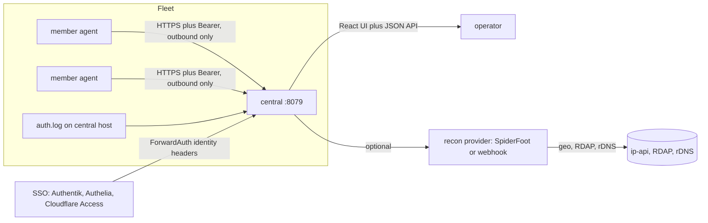
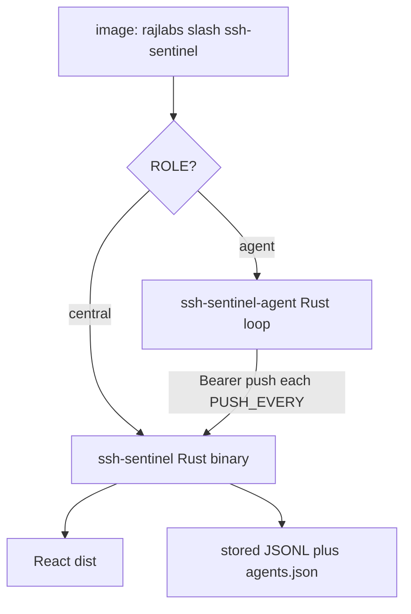
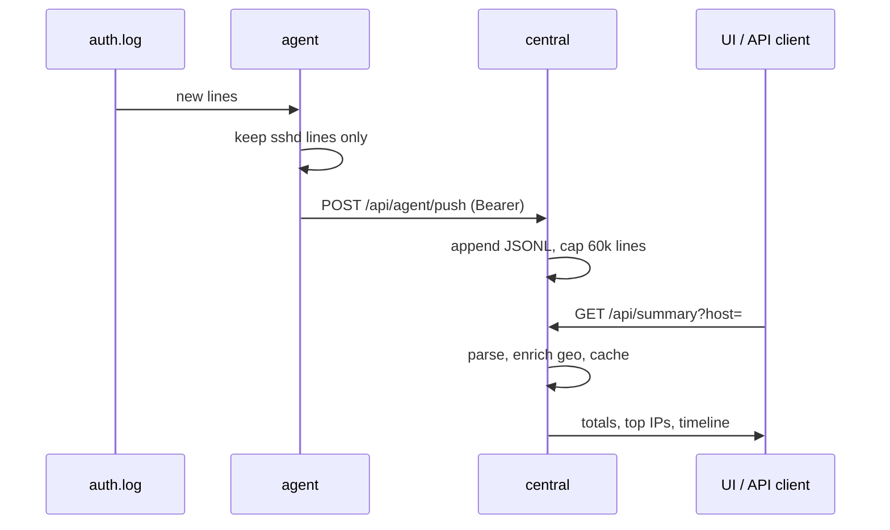
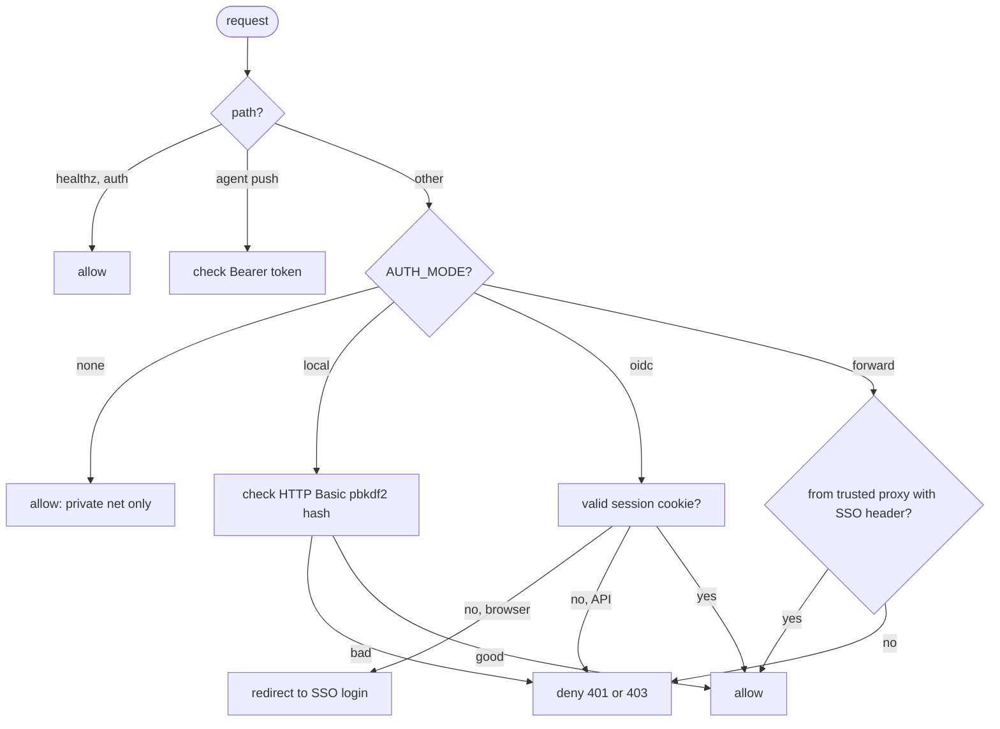
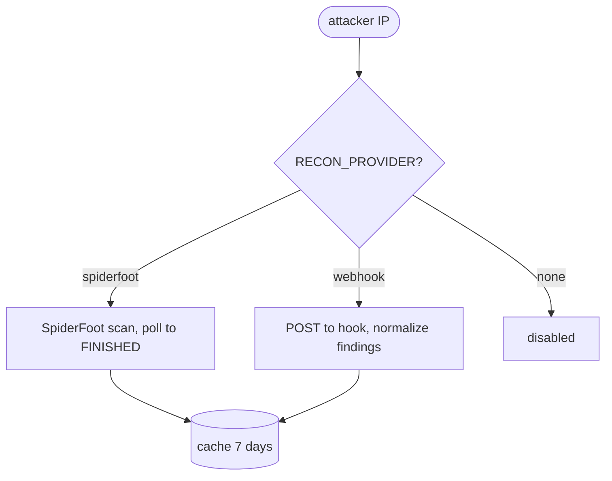
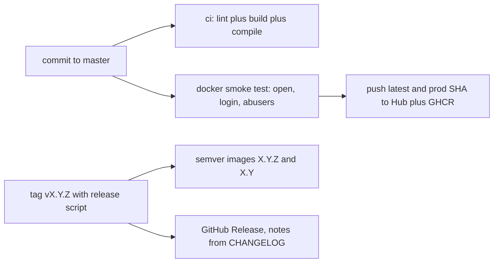

# SSH Sentinel — system architecture

> Style note: this document uses ASD-STE100 simplified English.
> Sentences are short. Each sentence has one idea.
> Procedures use numbered steps. Terms are defined once and reused.

## 1. Purpose

SSH Sentinel shows SSH attacks on one server or on many servers.
It collects auth logs. It counts failed logins.
It enriches attacker IPs with geo and intel data.
It presents the result in a web dashboard.

## 2. Terms

| Term | Meaning |
| ---- | ------- |
| central | The main container. It stores logs and serves the API and the UI. |
| agent | A lightweight shipper. It tails a log and pushes new lines to central. |
| member | A server that runs an agent. Members open no inbound ports. |
| fleet | One central plus zero or more agents. |
| scope | The data filter in the UI: the full fleet or one host. |

## 3. System context

Rules:

- Agents start the connection. Central never connects to agents.
- Members need no open ports. They need outbound HTTPS to central.
- Central serves the UI and the API on port 8079.
- Keep port 8079 in a private network. Or put SSO in front of it.

## 4. Container roles

One image serves two roles. `ROLE` selects the role.

| ROLE | Process | Inputs | Outputs |
| ---- | ------- | ------ | ------- |
| `central` (default) | `ssh-sentinel` (central-rs) | host log, agent pushes | UI, JSON API, stored JSONL |
| `agent` | `ssh-sentinel-agent` (agent-rs) | host log, `CENTRAL_URL`, `AGENT_TOKEN` | filtered log lines to central |

## 5. Data flow

Notes:

- The agent resumes from inode plus offset. It survives rotation and restarts.
- The server filters again on ingest. Old agents stay safe.
- Geo results stay in cache. The cache refreshes in the background.

## 6. Access control

Rules:

- Default mode is `local`. It denies all requests without credentials.
- `forward` trusts SSO headers only from `AUTH_TRUSTED_PROXIES`.
- `/api/abusers` shows attacker data only. It never shows logins or host names.

## 7. Recon providers

The webhook contract is small: send `{"ip": "1.2.3.4"}`,
receive `{"findings": [{"type": "...", "data": "...", "module": "..."}]}`.

SpiderFoot runs as an optional compose profile.
Start central plus SpiderFoot with one command.
Use `docker compose --profile recon up -d --build`.
Central reaches SpiderFoot at `http://spiderfoot:5001`.
No extra network setup is needed.

### 7.1. Enforcement (bans, risk store, reports)

Central keeps a SQLite index at `DATA_DIR/sentinel.db`.
Tables: `ip_stats`, `bans`, `reports`, `activity`, `kv`.
Logs stay the source of truth. The DB is derived.

Rules:

- Risk adds velocity (hits per hour) and repeat-ban signals.
- Accepted logins still clear an IP from the attacker list.
- `POST /api/admin/ban` writes `bans`, calls `fail2ban-client`, rewrites `banlist.txt`.
- `GET plus POST /api/admin/config` edits enforcement from UI. Values live in `kv`. Env set locks a field. No restart is needed.
- UI covers bans, reports, whitelist, trusted IPs and users, self IPs, and abusers quality bar. Secrets stay env-only. See `docs/FAIL2BAN.md` for blocking.
- Auto-ban runs each 60 seconds when `BAN_AUTO=1`.
- It skips self, whitelisted, private, and accepted IPs.
- Abuse reports send once per `REPORT_THROTTLE_DAYS` per provider.
- Payloads carry IP, hits, and risk only. No logins. No host names.
- Every ban, unban, report, and setup writes an `activity` row.
- Admin APIs need login. `/api/admin/status` is open and leaks no secrets.

## 8. Deployments

### 8.1. One server

1. Copy `.env.example` to `.env`.
2. Set `HOST_ID` and `AUTH_*` login values.
3. Run `docker compose up -d --build`.
4. Open `http://localhost:8079`.

### 8.2. Fleet on a tailnet

1. Start central on the main server.
2. Mint a token on central: `ssh-sentinel gentoken <host>`.
3. Start an agent on each member with the token.
4. Check `/api/hosts` on central. All members must show `online`.

### 8.3. Fleet with SSO

1. Set `AUTH_MODE=forward` on central.
2. Put Traefik plus Authentik in front of central.
3. Use `examples/sso-traefik-authentik.yml` as a starting point.
4. Keep direct access to port 8079 closed.

## 9. Release flow

Script `scripts/release.sh` updates `VERSION`, moves the
`Unreleased` section to a versioned section, commits, tags, and pushes.
